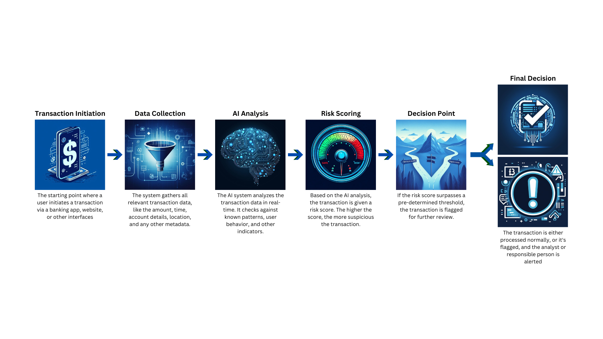

# FinTAD
Financial Transaction Anomaly Detector

For the Building AI course project

## Summary
FinTAD is an AI-driven system that analyzes and flags suspicious transactions in real-time to prevent fraudulent activities in banking systems. It scores the risk associated with every transaction, and raises an alert if a certain threshold was achieved. By learning from historical transaction data and adapting to new patterns, this solution reduces false positives, strengthening the security and trust aspects of the business.

## Background
Financial fraud is one of the biggest risks in digital banking, and fraudulent transactions result in billions of dollars of losses annually. Identifying and preventing these transactions proactively is the key aspect of managing this risk.

The system addresses this three core issues:
* Delay in detecting suspicious activities - the system will screen transactions in real-time
* High false positive rates in existing systems - lowering the number of false positives, the transactions will be executed faster, and there will be less workload for the risk analysts
* New fraud patterns - the system will be able to adapt to new methods used, and react on time

## How is it used?
Banks and financial institutions would integrate this system into their existing infrastructure. Whenever a transaction occurs, the system will analyze it in real-time and assign a risk score. If this score surpasses a pre-set threshold, an alert will be raised on the transaction and it will have to be reviewed.



Code example:
```python
import pandas as pd
from sklearn.ensemble import IsolationForest
from sklearn.model_selection import train_test_split
from sklearn.metrics import classification_report

# Loading the dataset
data = pd.read_csv('creditcard.csv')

# Separating feature and target
X = data.drop('Class', axis=1)
y = data['Class']

# Splitting data into training and testing sets
X_train, X_test, y_train, y_test = train_test_split(X, y, test_size=0.2, random_state=42)

# IsolationForest for anomaly detection as anomalies are rare in the dataset
clf = IsolationForest(contamination=0.002, random_state=42)
clf.fit(X_train)

# Predicting anomalies on the test set
y_pred = clf.predict(X_test)
y_pred = [1 if i == -1 else 0 for i in y_pred]

print(classification_report(y_test, y_pred))
```


## Data sources and AI methods
Data sources include:

* Historical transaction data from banks (both normal and fraudulent)
* User behavior patterns (e.g., typical transaction amounts, frequency, locations)
* We'll utilize supervised machine learning models, specifically deep learning architectures like LSTM (Long Short-Term Memory) due to their capabilities to work with sequence data, combined with features extracted using traditional methods.
* Scikit-learn and TensorFlow will be used in model development.

## Challenges
1. Balancing between false positives and false negatives
2. Protecting sensitive financial data, ensuring GDPR compliance and other data protection regulations
3. Continuous model updating: as fraud patterns evolve, the model will need to be retrained

## What next?
1. Extend the model to predict potential future threats or new fraud patterns by incorporating unsupervised learning techniques
2. Collaborate with banks for pilot implementation and feedback collection
3. Need for further expertise in cybersecurity and financial regulations for large-scale deployment

## Acknowledgments
[Twitter API](https://developer.twitter.com/en/docs)

[Kaggle's Credit Card Fraud Detection Dataset](https://www.kaggle.com/datasets/mlg-ulb/creditcardfraud/data) - for initial prototyping and testing.

Scholary articles on financial fraud detection from [arXiv](https://arxiv.org/)

Images: Canva, DALL-E 3

Sklearn tutorial: [ioflood](https://ioflood.com/blog/train-test-split-sklearn/)
